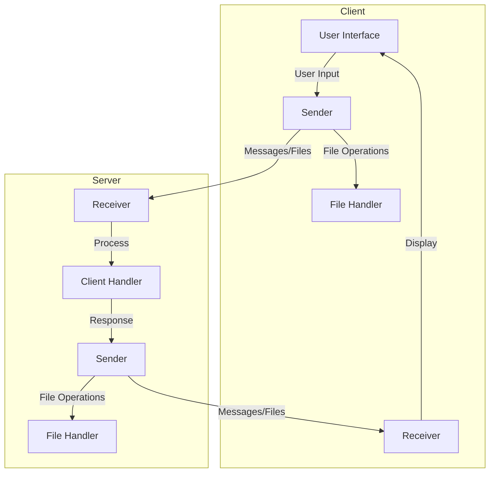
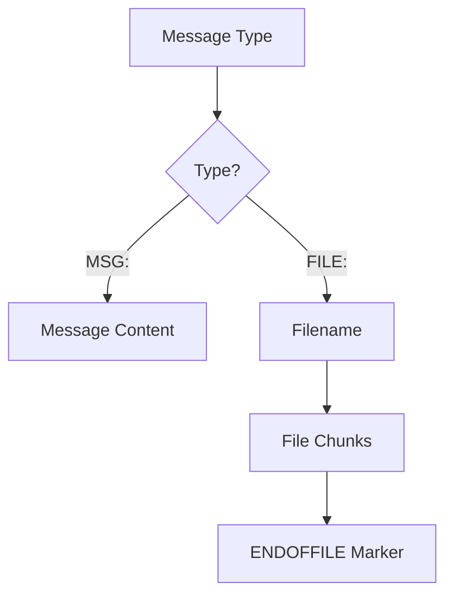
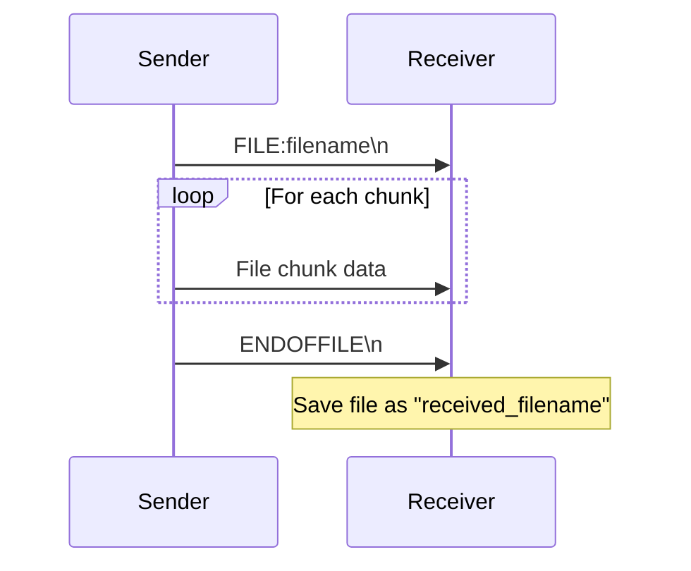
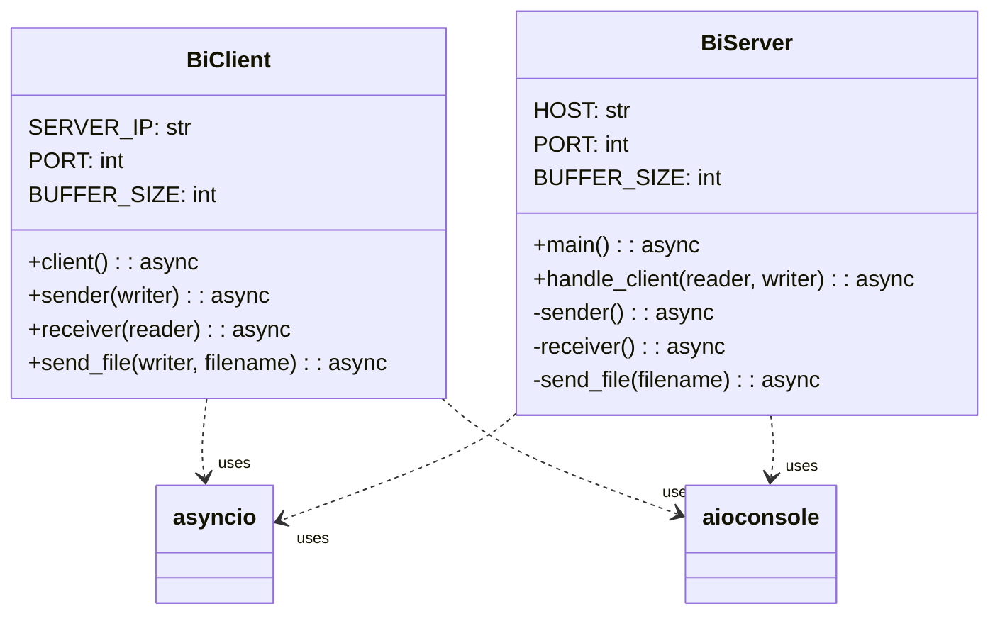
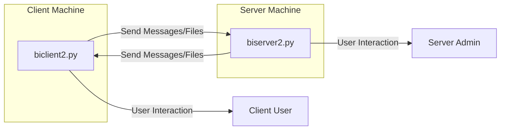

# Distributed System Mermaid Diagrams

This document contains Mermaid diagrams that explain the architecture and flow of the bidirectional client-server system.

## System Architecture



## Protocol Structure



## Client Flow Diagram

```mermaid
flowchart TD
    Start[Start Client] --> Connect[Connect to Server]
    Connect --> CreateTasks[Create Sender/Receiver Tasks]
    
    subgraph Sender Task
        SenderStart[Start Sender] --> GetUserInput[Get User Input]
        GetUserInput --> CheckInput{Input Type?}
        CheckInput -->|Normal Message| SendMessage[Send "MSG:" + message]
        CheckInput -->|Send File Command| GetFilename[Get Filename]
        GetFilename --> CheckFileExists{File Exists?}
        CheckFileExists -->|Yes| SendFileHeader[Send "FILE:" + filename]
        SendFileHeader --> SendFileChunks[Send File in Chunks]
        SendFileChunks --> SendEOF[Send ENDOFFILE marker]
        CheckFileExists -->|No| FileNotFound[Show "File not found"]
        FileNotFound --> GetUserInput
        CheckInput -->|Exit Command| BreakLoop[Exit Loop]
        SendMessage --> GetUserInput
        SendEOF --> GetUserInput
    end
    
    subgraph Receiver Task
        ReceiverStart[Start Receiver] --> ReadData[Read Data from Server]
        ReadData --> CheckData{Data Type?}
        CheckData -->|"MSG:"| DisplayMessage[Display Message]
        CheckData -->|"FILE:"| ExtractFilename[Extract Filename]
        ExtractFilename --> CreateFile[Create File]
        CreateFile --> ReceiveChunks[Receive File Chunks]
        ReceiveChunks --> CheckForEOF{End of File?}
        CheckForEOF -->|No| ReceiveChunks
        CheckForEOF -->|Yes| SaveFile[Save File]
        DisplayMessage --> ReadData
        SaveFile --> ReadData
        CheckData -->|No Data| ConnectionClosed[Connection Closed]
    end
    
    CreateTasks --> WaitForCompletion[Wait for Tasks Completion]
    WaitForCompletion --> CleanUp[Clean Up and Close Connection]
    CleanUp --> End[End Client]
```

## Server Flow Diagram

```mermaid
flowchart TD
    Start[Start Server] --> CreateServer[Create Server on Port 12345]
    CreateServer --> WaitForConnections[Wait for Client Connections]
    WaitForConnections --> ClientConnects[Client Connects]
    ClientConnects --> HandleClient[Handle Client]
    HandleClient --> CreateTasks[Create Sender/Receiver Tasks for Client]
    
    subgraph Client Handler
        subgraph Sender Task
            SenderStart[Start Sender] --> GetServerInput[Get Server Input]
            GetServerInput --> CheckInput{Input Type?}
            CheckInput -->|Normal Message| SendMessage[Send "MSG:" + message]
            CheckInput -->|Send File Command| GetFilename[Get Filename]
            GetFilename --> CheckFileExists{File Exists?}
            CheckFileExists -->|Yes| SendFileHeader[Send "FILE:" + filename]
            SendFileHeader --> SendFileChunks[Send File in Chunks]
            SendFileChunks --> SendEOF[Send ENDOFFILE marker]
            CheckFileExists -->|No| FileNotFound[Show "File not found"]
            FileNotFound --> GetServerInput
            CheckInput -->|Exit Command| SendExitMessage[Send Exit Message]
            SendExitMessage --> BreakLoop[Exit Loop]
            SendMessage --> GetServerInput
            SendEOF --> GetServerInput
        end
        
        subgraph Receiver Task
            ReceiverStart[Start Receiver] --> ReadData[Read Data from Client]
            ReadData --> CheckData{Data Type?}
            CheckData -->|"MSG:"| DisplayMessage[Display Message]
            CheckData -->|"FILE:"| ExtractFilename[Extract Filename]
            ExtractFilename --> CreateFile[Create File with "received_" prefix]
            CreateFile --> ReceiveChunks[Receive File Chunks]
            ReceiveChunks --> CheckForEOF{End of File?}
            CheckForEOF -->|No| ReceiveChunks
            CheckForEOF -->|Yes| SaveFile[Save File]
            DisplayMessage --> ReadData
            SaveFile --> ReadData
            CheckData -->|No Data| ClientDisconnected[Client Disconnected]
            ClientDisconnected --> ExitReceiver[Exit Receiver]
        end
    end
    
    CreateTasks --> WaitForTasksCompletion[Wait for Tasks Completion]
    WaitForTasksCompletion --> CleanUp[Clean Up and Close Connection]
    CleanUp --> WaitForConnections
```

## File Transfer Sequence Diagram



## Code Structure



## System Communication Overview

